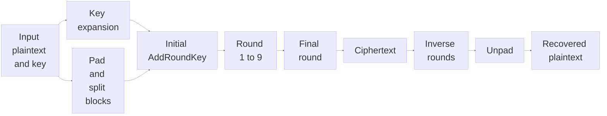
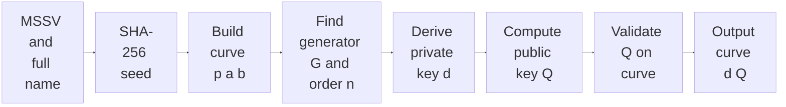
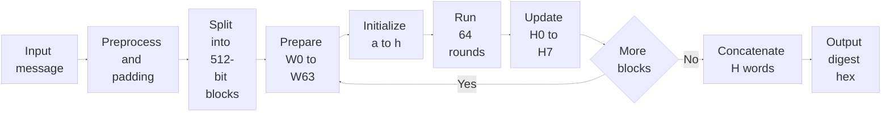
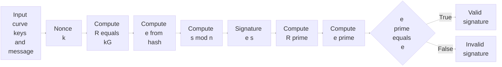
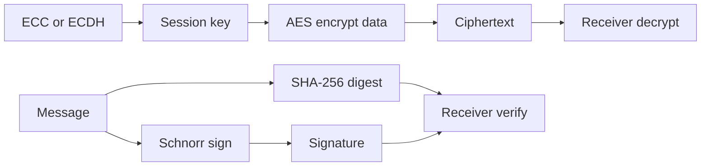

# Mermaid Diagrams

## 1) AES-128 Flow

```mermaid
%%{init: {'themeVariables': {'fontSize': '60px'}, 'flowchart': {'nodeSpacing': 60, 'rankSpacing': 50, 'padding': 36, 'curve': 'basis'}}}%%
flowchart LR
    A[Input plaintext and key]
    B[Key expansion]
    C[Pad and split blocks]
    D[Initial AddRoundKey]
    E[Round 1 to 9]
    F[Final round]
    G[Ciphertext]
    H[Inverse rounds]
    I[Unpad]
    J[Recovered plaintext]

    A --> B
    A --> C
    B --> D
    C --> D
    D --> E --> F --> G --> H --> I --> J
```

## 2) ECC Flow (Key Generation)

```mermaid
%%{init: {'themeVariables': {'fontSize': '60px'}, 'flowchart': {'nodeSpacing': 60, 'rankSpacing': 50, 'padding': 36, 'curve': 'basis'}}}%%
flowchart LR
    A[MSSV and full name] --> B[SHA-256 seed]
    B --> C[Build curve p a b]
    C --> D[Find generator G and order n]
    D --> E[Derive private key d]
    E --> F[Compute public key Q]
    F --> G[Validate Q on curve]
    G --> H[Output curve d Q]
```

## 3) SHA-256 Flow

```mermaid
%%{init: {'themeVariables': {'fontSize': '60px'}, 'flowchart': {'nodeSpacing': 60, 'rankSpacing': 50, 'padding': 36, 'curve': 'basis'}}}%%
flowchart LR
    A[Input message] --> B[Preprocess and padding]
    B --> C[Split into 512-bit blocks]
    C --> D[Prepare W0 to W63]
    D --> E[Initialize a to h]
    E --> F[Run 64 rounds]
    F --> G[Update H0 to H7]
    G --> H{More blocks}
    H -- Yes --> D
    H -- No --> I[Concatenate H words]
    I --> J[Output digest hex]
```

## 4) Schnorr Signature Flow

```mermaid
%%{init: {'themeVariables': {'fontSize': '60px'}, 'flowchart': {'nodeSpacing': 60, 'rankSpacing': 50, 'padding': 36, 'curve': 'basis'}}}%%
flowchart LR
    A[Input curve keys and message] --> B[Nonce k]
    B --> C[Compute R equals kG]
    C --> D[Compute e from hash]
    D --> E[Compute s mod n]
    E --> F[Signature e s]
    F --> G[Compute R prime]
    G --> H[Compute e prime]
    H --> I{e prime equals e}
    I -- True --> J[Valid signature]
    I -- False --> K[Invalid signature]
```

## Optional: System Integration (4 Algorithms)

```mermaid
%%{init: {'themeVariables': {'fontSize': '24px'}, 'flowchart': {'nodeSpacing': 44, 'rankSpacing': 36, 'padding': 16, 'curve': 'basis'}}}%%
flowchart LR
    A[ECC or ECDH] --> B[Session key] --> C[AES encrypt data] --> H[Ciphertext] --> I[Receiver decrypt]
    D[Message] --> E[SHA-256 digest] --> J[Receiver verify]
    D --> F[Schnorr sign] --> G[Signature] --> J
```
