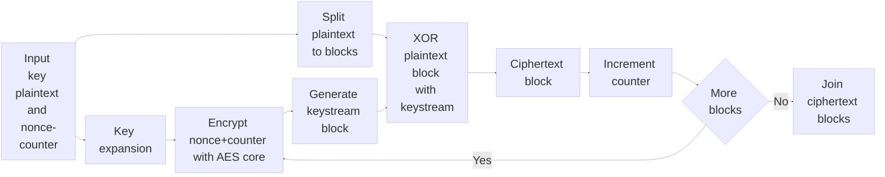
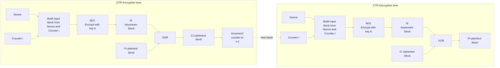
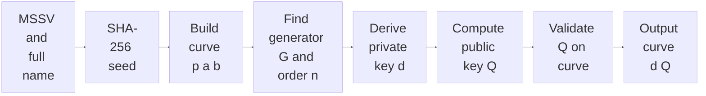
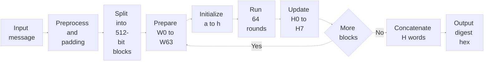
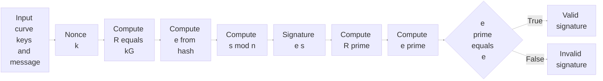
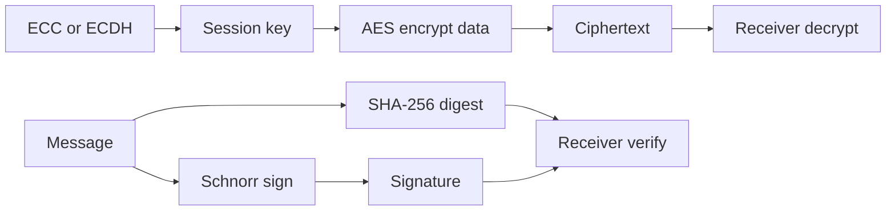
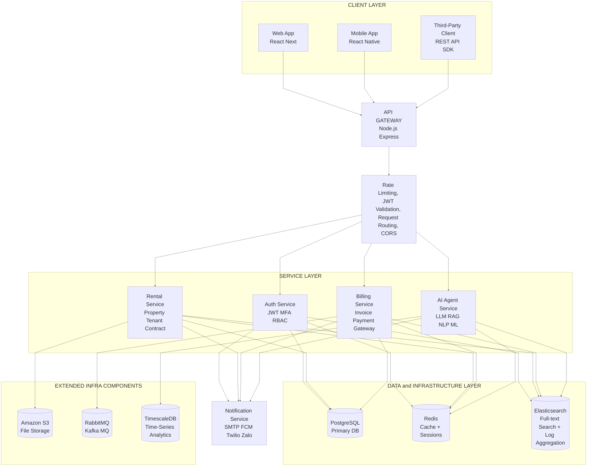

# Mermaid Diagrams

## 1) AES-128 CTR Flow

## 1.1) CTR Block Diagram

## 2) ECC Flow (Key Generation)

## 3) SHA-256 Flow

## 4) Schnorr Signature Flow

## Optional: System Integration (4 Algorithms)

## 5) System Architecture (From Image)

